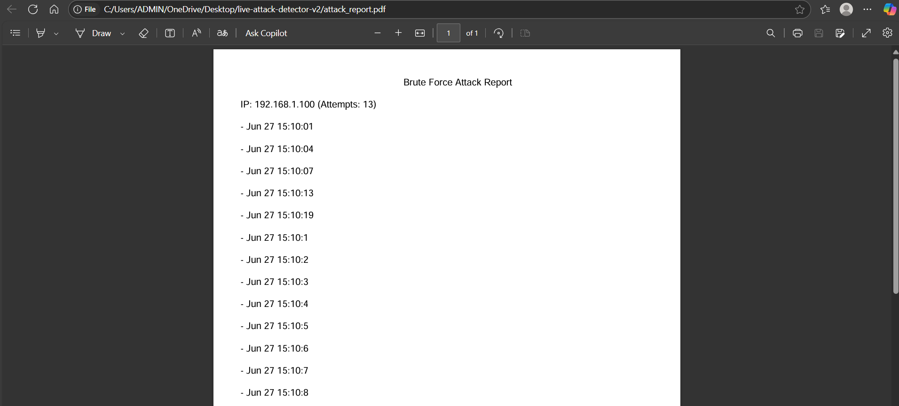

# 🛡️ Live Attack Detector

A Python-based brute-force attack detector that analyzes Linux SSH logs, identifies suspicious IPs with multiple failed login attempts, and generates a clean, timestamped PDF report — ready for SOC-level triage or documentation.

---

## 📌 Features

- ✅ Parses `auth.log` files from Linux systems
- ✅ Detects brute-force attempts (>5 failed logins)
- ✅ Groups timestamps by attacker IP
- ✅ Generates clean PDF report with all timestamps
- ✅ Lightweight, beginner-friendly codebase
- ✅ No external dependencies beyond `fpdf`

---

## 🖼️ Sample Output (PDF)



✅ You can also open [`attack_report.pdf`](./attack_report.pdf) to see the full output.

---

## ⚙️ How It Works

1. Reads your system's `auth.log` file.
2. Extracts:
   - IP address from failed login lines
   - Timestamps of attempts
3. Counts attempts per IP.
4. If an IP exceeds threshold (5+), logs all timestamps.
5. Outputs all grouped logs to a PDF using `fpdf`.

---

## 🧪 Demo Logs

```bash
for i in {1..10}; do echo "Jun 27 15:10:$i sshd[1111]: Failed password for root from 192.168.1.100 port 22 ssh2" >> auth.log; done

## 🚀 How to Run

### 🔧 Requirements
- Python 3.x
- `fpdf` library

### 🛠️ Setup Instructions

```bash
# Clone the repo
git clone https://github.com/your-username/live-attack-detector.git
cd live-attack-detector

# Create a virtual environment
python3 -m venv venv
source venv/bin/activate

# Install required libraries
pip install -r requirements.txt

# Run the script
python attack_detector.py


Brute Force Attack Report

IP: 192.168.1.100 (Attempts: 13)
 - Jun 27 15:10:01
 - Jun 27 15:10:04
 - Jun 27 15:10:07

---

👨‍💻 Author
Danukshan Devendran
Student | Cybersecurity Enthusiast | Builder
📧 devendran.danukshan@gmail.com
🌐 https://www.linkedin.com/in/danukshandevendran/

---